# Affected Tests

A Gradle plugin that detects changes in the current branch and runs only the unit and integration tests relevant to those changes. No seed run required — it works immediately.

**Target stack:** Gradle 8+ (primary support: 9.x), Java 21+, JUnit 5

## Quick Start

### 1. Apply the plugin

```groovy
// build.gradle
plugins {
    id 'io.github.vedanthvdev.affectedtests' version 'x.y.z'
}
```

> Check [Gradle Plugin Portal](https://plugins.gradle.org/plugin/io.github.vedanthvdev.affectedtests) for the latest version.

### 2. Run affected tests

```bash
./gradlew affectedTest
```

### 3. (Optional) Explain the decision

```bash
./gradlew affectedTest --explain
```

Prints the full decision trace — bucket counts, situation, action, and the tier of the priority ladder (explicit / legacy / mode / hardcoded) that picked each action — without running a single test. Useful when a CI run escalated to the full suite and the operator needs to know *why* before filing a bug.

Sample output:

```
=== Affected Tests — decision trace (--explain) ===
Base ref:        origin/master
Mode:            unset (effective: n/a (pre-v2 defaults))
Changed files:   3
Buckets:
  ignored         1
  out-of-scope    0
  production .java 1
  test .java      0
  unmapped        1
  ignored sample: README.md
  production sample: src/main/java/com/example/Foo.java
  unmapped sample: build.gradle
Situation:       UNMAPPED_FILE
Action:          FULL_SUITE (source: pre-v2 hardcoded default)
Outcome:         FULL_SUITE — runAllOnNonJavaChange=true / onUnmappedFile=FULL_SUITE — non-Java or unmapped file in diff
Action matrix (situation → action [source]):
  EMPTY_DIFF               SKIPPED [pre-v2 hardcoded default]
  ALL_FILES_IGNORED        SKIPPED [pre-v2 hardcoded default]
  ALL_FILES_OUT_OF_SCOPE   SKIPPED [pre-v2 hardcoded default]
  UNMAPPED_FILE            FULL_SUITE [pre-v2 hardcoded default]
  DISCOVERY_EMPTY          SKIPPED [pre-v2 hardcoded default]
  DISCOVERY_SUCCESS        SELECTED [explicit onXxx setting]
=== end --explain ===
```

That's it. With zero config, the plugin will:

- Diff against `origin/master` (including uncommitted + staged changes).
- Route each changed file through one of five buckets: **ignored** (`*.md`, LICENSE, CHANGELOG, images, `**/generated/**`), **out-of-scope**, **production `.java`**, **test `.java`**, or **unmapped** (everything else, e.g. `application.yml`).
- Pick a discovery strategy — **naming**, **usage**, **impl**, **transitive** — and merge their results into one test set.
- Follow 4 levels of transitive dependencies (tuned for typical controller → service → repository chains).
- Fall through to the full suite if it encounters an unmapped file, so a YAML/Gradle/Liquibase diff never ships without tests.

## CI Integration

### GitHub Actions

```yaml
- run: ./gradlew affectedTest -PaffectedTestsBaseRef=${{ github.event.pull_request.base.sha }}
```

### GitLab CI / Jenkins

```bash
./gradlew affectedTest -PaffectedTestsBaseRef=origin/main
```

> Make sure to use `fetch-depth: 0` so `git diff` has access to the full history.

## The v2 decision model

Every invocation resolves to exactly one **Situation** and exactly one **Action**, both of which appear in the log line so an operator can tell — at a glance — why the plugin chose what it did.

### Summary log format

Every `affectedTest` run prints exactly one summary line in the form `Affected Tests: <OUTCOME> (<SITUATION>) — <details>`:

```
Affected Tests: SELECTED (DISCOVERY_SUCCESS) — 3 changed file(s), 2 production class(es), 5 test class(es) affected
Affected Tests: FULL_SUITE (UNMAPPED_FILE) — 1 changed file(s); running full suite (runAllOnNonJavaChange=true / onUnmappedFile=FULL_SUITE — non-Java or unmapped file in diff).
Affected Tests: SKIPPED (ALL_FILES_IGNORED) — 1 changed file(s); every changed file matched ignorePaths.
```

The outcome (`SELECTED` / `FULL_SUITE` / `SKIPPED`) and the situation that produced it are first-class fields on every branch, so CI dashboards can `grep -E '^Affected Tests: (SELECTED|FULL_SUITE|SKIPPED)'` and bucket runs without parsing the tail. Every pre-v2 phrase (`running full suite`, `runAllIfNoMatches=true`, `runAllOnNonJavaChange=true`, `no affected tests discovered`) still appears verbatim in the reason segment, so existing greps keep working.

### Situations (what the engine saw)

| Situation | Fires when |
|---|---|
| `EMPTY_DIFF` | `git diff` produced no files at all. |
| `ALL_FILES_IGNORED` | Every file in the diff matched `ignorePaths` (e.g. a docs-only MR). |
| `ALL_FILES_OUT_OF_SCOPE` | Every file sat under `outOfScopeTestDirs` or `outOfScopeSourceDirs` (e.g. a Cucumber/api-test-only MR). |
| `UNMAPPED_FILE` | The diff contains at least one file the plugin cannot resolve to a Java class under `sourceDirs`/`testDirs` (e.g. `application.yml`, `build.gradle`, a Liquibase changelog). |
| `DISCOVERY_EMPTY` | Mapping succeeded but the discovery strategies returned zero tests. |
| `DISCOVERY_SUCCESS` | Mapping + discovery produced a non-empty test set. |

### Actions (what the engine will do)

| Action | Meaning |
|---|---|
| `SELECTED` | Run only the discovered affected tests. |
| `FULL_SUITE` | Run the entire test suite (no `--tests` filter). |
| `SKIPPED` | Exit 0 without running tests. |

Every situation gets an independently-configurable action. The matrix is resolved in strict priority order: **explicit `onXxx`** setting → **legacy boolean** (`runAllIfNoMatches` / `runAllOnNonJavaChange`) → **`mode` profile default** → **pre-v2 hardcoded default**. So nothing you configure today silently regresses tomorrow.

### Mode profiles

`mode` seeds the defaults for situations you haven't explicitly configured:

| Mode | `EMPTY_DIFF` | `ALL_FILES_IGNORED` | `ALL_FILES_OUT_OF_SCOPE` | `UNMAPPED_FILE` | `DISCOVERY_EMPTY` |
|---|---|---|---|---|---|
| `local` | SKIPPED | SKIPPED | SKIPPED | FULL_SUITE | SKIPPED |
| `ci` | SKIPPED | SKIPPED | SKIPPED | FULL_SUITE | **FULL_SUITE** |
| `strict` | FULL_SUITE | FULL_SUITE | SKIPPED | FULL_SUITE | FULL_SUITE |
| `auto` | Detects `CI` / `GITHUB_ACTIONS` / `GITLAB_CI` / `JENKINS_HOME` and resolves to `ci` or `local`. |

Leaving `mode` unset keeps the pre-v2 zero-config behaviour (same as `local` plus the legacy `runAllOnNonJavaChange=true` safety net).

## Configuration

All settings have sensible defaults. Override only what you need.

```groovy
affectedTests {
    // Git base ref to diff against (default: "origin/master")
    baseRef = "origin/main"

    // Include uncommitted/staged changes (default: true)
    includeUncommitted = true
    includeStaged = true

    // v2 profile. "auto" is the recommended migration target.
    // See the "Mode profiles" table above.
    // (default: unset — preserves pre-v2 defaults)
    mode = "auto"

    // ---------------- Path buckets (v2) ----------------

    // Files that must not influence test selection (docs, LICENSE,
    // CHANGELOG, images, generated sources). When every file in the
    // diff matches ignorePaths, the engine lands on ALL_FILES_IGNORED.
    // The defaults already cover markdown/text/LICENSE/CHANGELOG/images
    // at both the repo root and nested paths — you usually only extend this.
    ignorePaths = ["**/*Dto.java"]

    // Test source sets the plugin must not dispatch via the affectedTest
    // task (e.g. Cucumber, Gatling). A diff entirely under these dirs
    // routes to ALL_FILES_OUT_OF_SCOPE → SKIPPED by default.
    outOfScopeTestDirs = ["api-test/src/test/java", "api-test/src/test/resources"]

    // Production source sets the plugin must treat as out-of-scope.
    outOfScopeSourceDirs = []

    // ---------------- Per-situation actions (v2) ----------------

    // Each takes one of "selected" | "full_suite" | "skipped".
    // Any value left unset falls back through mode → pre-v2 default.
    onEmptyDiff            = "skipped"
    onAllFilesIgnored      = "skipped"
    onAllFilesOutOfScope   = "skipped"
    onUnmappedFile         = "full_suite"  // the key MR-safety knob
    onDiscoveryEmpty       = "full_suite"  // belt-and-braces for CI

    // ---------------- Discovery tuning ----------------

    // Discovery strategies: "naming", "usage", "impl", "transitive" (default: all four)
    strategies = ["naming", "usage", "impl", "transitive"]

    // Transitive dependency depth — used when the "transitive" strategy is enabled.
    // Raised from 2 → 4 in v2 because typical Spring controller→service→repo
    // chains are 2–3 deep; 4 gives a margin without producing runaway sets.
    // (default: 4, max: 5, 0 = disabled)
    transitiveDepth = 4

    // Test class suffixes (default: ["Test", "IT", "ITTest", "IntegrationTest"])
    testSuffixes = ["Test", "IT", "ITTest", "IntegrationTest"]

    // Source directories (default: ["src/main/java"])
    sourceDirs = ["src/main/java"]

    // Test directories (default: ["src/test/java"])
    testDirs = ["src/test/java"]

    // Include tests for implementations of changed interfaces (default: true)
    includeImplementationTests = true

    // Implementation naming prefixes/suffixes — "Impl" matches FooImpl for Foo;
    // "Default" matches DefaultFoo for Foo, which is idiomatic in Spring code.
    // (default: ["Impl", "Default"])
    implementationNaming = ["Impl", "Default"]
}
```

## How It Works

The pipeline is five stages: **detect** what changed, **bucket** each path (ignored / out-of-scope / production / test / unmapped), **resolve** the `Situation`, **discover** the tests impacted by the in-scope Java classes, and **execute** only that subset — or the full suite, or nothing at all — based on the `Action` the `Situation` maps to.

<p align="center">
  
</p>

<sub>Source: [`docs/architecture.mmd`](docs/architecture.mmd) · regenerate with `npx --yes @mermaid-js/mermaid-cli -i docs/architecture.mmd -o docs/architecture.svg -b transparent`</sub>

### Discovery Strategies

All four strategies run against every changed production class. Their results are merged (union), so a test is run if **any** strategy identifies it. The goal is maximum coverage — running a few extra tests is always preferable to missing one.

| Strategy | What it does | Example |
|----------|-------------|---------|
| **naming** | For each changed class `Foo`, looks for test files named `FooTest`, `FooIT`, `FooITTest`, `FooIntegrationTest` (configurable suffixes). Purely file-name based — no parsing required. | `FooService` changed → finds `FooServiceTest`, `FooServiceIT` |
| **usage** | Parses every test file with JavaParser and checks whether it references any changed class. Uses a two-tier approach: **(1)** direct import match — if the test has `import com.example.FooService;`, it's affected regardless of how it uses the class; **(2)** type-reference scan for wildcard imports (`import com.example.*`) and same-package usage (no import needed). Catches fields, method parameters, return types, constructor calls, generics, and casts. | `BarModel` changed → finds `BarValidatorTest` (imports it), `BazMapperTest` (same package, uses it as field type) |
| **impl** | When an interface or base class changes, scans all production source files to find classes that `extends` or `implements` the changed type (via AST) and classes following the `*Impl` or `Default*` naming convention. Then re-runs the naming and usage strategies on those implementations. | `FooService` (interface) changed → finds `FooServiceImpl` and `DefaultFooService` → finds `FooServiceImplTest` / `DefaultFooServiceTest` |
| **transitive** | Builds a reverse dependency map of all production classes: for each class, which other classes depend on it (via field types). When a class changes, walks this "used-by" graph N levels deep (configurable, default 4, max 5) to find consumers. Then runs naming + usage on those consumers. | `BazGateway` changed → `FooService` uses it (depth 1) → `OrdersController` uses `FooService` (depth 2) → finds both tests via naming |

### How scanning works

The plugin scans the project tree **recursively at any depth** to find source and test directories. It is completely project-structure agnostic — it does not assume any particular module layout. Whether your modules are flat (`api/src/test/java`), nested (`services/orders/src/test/java`), or deeply nested (`platform/services/orders/src/test/java`), all test files are discovered.

Directories like `.git`, `build`, `.gradle`, and `node_modules` are automatically skipped during the walk. `outOfScopeTestDirs` and `outOfScopeSourceDirs` are additionally filtered at index time so discovery never picks up tests living there.

### Directly changed tests

Any test file that is itself modified in the diff is **always** included in the run, regardless of strategy results.

## Multi-Module Support

The plugin works out of the box with multi-module projects — it recursively scans all modules at any nesting depth, so no configuration is needed.

Internally, each discovered test FQN is traced back to the Gradle subproject that owns its file, and tests are then dispatched per module:

```
./gradlew :moduleA:test --tests com.example.FooTest \
          :moduleB:test --tests com.example.BarTest
```

This makes `--tests` filters scope cleanly to their owning module, instead of being applied globally and failing on any subproject that doesn't happen to contain the FQN. Cross-module imports (e.g. a test in `application` that imports a class from `api`) are still detected correctly via the `usage` and `impl` strategies.

## Behaviour reference

Every row below shows the situation the engine resolved, and the action applied with the default configuration (no `mode` set, no explicit `onXxx`).

| Diff contents | Resolved `Situation` | Default `Action` | Override knob |
|---|---|---|---|
| Only mapped production/test `.java` files | `DISCOVERY_SUCCESS` (or `DISCOVERY_EMPTY` if no tests map) | `SELECTED` | discovery tuning |
| Only files matching `ignorePaths` (docs, LICENSE, CHANGELOG, images, generated) | `ALL_FILES_IGNORED` | `SKIPPED` | `onAllFilesIgnored` or `mode=strict` |
| Only files under `outOfScopeTestDirs` / `outOfScopeSourceDirs` (e.g. api-test only) | `ALL_FILES_OUT_OF_SCOPE` | `SKIPPED` | `onAllFilesOutOfScope` |
| Any YAML / Gradle / Liquibase / `.java` outside configured dirs | `UNMAPPED_FILE` | `FULL_SUITE` (via `onUnmappedFile = "full_suite"`) | `onUnmappedFile = "selected"` |
| No changed files at all | `EMPTY_DIFF` | `SKIPPED` | `onEmptyDiff = "full_suite"` / `mode = strict` |
| Mapping succeeds but discovery returns zero tests | `DISCOVERY_EMPTY` | `SKIPPED` — or `FULL_SUITE` if `mode=ci`/`strict` | `onDiscoveryEmpty` / `mode` |
| Mixed diff: Java + unmapped file | `UNMAPPED_FILE` (takes precedence) | `FULL_SUITE` | `onUnmappedFile` — set to `"selected"` to fall through to discovery |
| `baseRef` not resolvable | `FAILED` | Hard error (prevents silent test skipping in CI) | — |
| Not a git work tree / JGit I/O error | `FAILED` | Hard error | — |

The `onUnmappedFile = "full_suite"` default follows the "run more, never run less" principle: a change to `application.yml` can alter production behaviour just as surely as a change to a `.java` file, so the plugin cannot safely pick a subset from an empty Java mapping.

### Migrating from v1 config

Existing configs keep working — **no pipeline breaks today**. But the legacy knobs are deprecated and will be removed in **v2.0.0**. If any of these appear in your `build.gradle`, the plugin will print a `WARNING` on every `affectedTest` run naming the replacement:

- `runAllIfNoMatches`
- `runAllOnNonJavaChange`
- `excludePaths`

#### Deprecation timeline

| Release | What happens |
|---|---|
| **v1.9.x and earlier** | Legacy knobs work silently. No warnings. |
| **v1.10.x** (this release) | Legacy knobs still work. A per-run `WARNING: [affected-tests] '<knob>' is deprecated…` names each one and its replacement. Zero-config users see nothing. |
| **v2.0.0** (next major) | Legacy knobs removed. `excludePaths`, `runAllIfNoMatches`, `runAllOnNonJavaChange` become unknown properties — Gradle will fail configuration. |

#### Before / after

| v1 config | v2 equivalent | Why |
|---|---|---|
| `runAllIfNoMatches = true` | `onEmptyDiff = "full_suite"` **and** `onDiscoveryEmpty = "full_suite"` | The v1 flag conflated two different situations ("git diff is empty" vs "discovery found nothing"). v2 splits them so you can e.g. skip empty-diff runs but still fall back to full suite when discovery fails. |
| `runAllIfNoMatches = false` (explicit) | Leave `onEmptyDiff` / `onDiscoveryEmpty` unset (defaults to `SKIPPED`) or set `mode = "local"` | Same effect, zero config. |
| `runAllOnNonJavaChange = true` | `onUnmappedFile = "full_suite"` | Single-situation knob, same semantics. |
| `runAllOnNonJavaChange = false` | `onUnmappedFile = "selected"` | Plugin treats the unmapped file as if absent and continues to discovery. |
| `excludePaths = ["**/generated/**"]` | `ignorePaths = ["**/generated/**"]` | Identical semantics — just a rename. |
| `excludePaths = []` (explicit empty) | **Delete the line** | v2's default `ignorePaths` list is broader (markdown, licence, changelog, images, generated). Explicitly empty discards all of it. |

#### Worked example

**Before (v1):**

```groovy
affectedTests {
    baseRef = "origin/master"
    runAllIfNoMatches = true
    runAllOnNonJavaChange = true
    excludePaths = ["**/generated/**"]
    transitiveDepth = 4
}
```

**After (v2):**

```groovy
affectedTests {
    baseRef = "origin/master"
    mode = "ci"                                // one line replaces both booleans in 95% of cases
    // excludePaths / ignorePaths unset — v2 default already covers generated/
    // transitiveDepth = 4 now the default, no need to set it
}
```

Or if you want every situation explicit (recommended for production pipelines where you care about each edge case):

```groovy
affectedTests {
    baseRef = "origin/master"
    onEmptyDiff          = "full_suite"
    onAllFilesIgnored    = "skipped"
    onAllFilesOutOfScope = "skipped"
    onUnmappedFile       = "full_suite"
    onDiscoveryEmpty     = "full_suite"
}
```

#### Decision tree — "which replacement do I need?"

```
Did you set runAllIfNoMatches?
├─ No                    → nothing to do for this knob
├─ runAllIfNoMatches = true
│  └─ set onEmptyDiff = "full_suite" AND onDiscoveryEmpty = "full_suite"
│     (or just set mode = "ci" / mode = "strict" — both imply it)
└─ runAllIfNoMatches = false
   └─ just delete the line (v2 default is SKIPPED)

Did you set runAllOnNonJavaChange?
├─ No                           → nothing to do
├─ runAllOnNonJavaChange = true → set onUnmappedFile = "full_suite"
│                                  (or just delete the line — it's the default)
└─ runAllOnNonJavaChange = false → set onUnmappedFile = "selected"

Did you set excludePaths?
├─ No                → nothing to do
├─ excludePaths = [] → delete the line (you probably want the broader v2 default)
└─ excludePaths = [...] → rename to ignorePaths with the same list
```

#### What the summary log tells you during migration

Every `affectedTest` run prints the outcome + situation + legacy flag (if applicable) on one line, so existing grep-based CI dashboards keep matching during and after the migration:

```
Affected Tests: FULL_SUITE (UNMAPPED_FILE) — 1 changed file(s); running full suite (runAllOnNonJavaChange=true / onUnmappedFile=FULL_SUITE — non-Java or unmapped file in diff).
```

Both vocabularies appear — the v2 name (`onUnmappedFile=FULL_SUITE`) and the legacy name (`runAllOnNonJavaChange=true`) — so you can migrate without breaking any existing alert rules.

## Project Structure

```
affected-tests/
├── affected-tests-core/          # Git integration, change detection, test discovery
├── affected-tests-gradle/        # Gradle plugin (io.github.vedanthvdev.affectedtests)
├── docs/
│   ├── DESIGN-v2.md              # v2 design document (situation/action/mode model)
│   ├── architecture.mmd          # Mermaid source for the architecture diagram
│   └── architecture.svg          # Rendered diagram embedded in README
├── build.gradle
├── settings.gradle
└── README.md
```

## Requirements

| Component | Version |
|-----------|---------|
| Gradle | 8.x+, primary support on 9.x |
| Java | 21+ |
| JUnit | 5.x |
| Spring Boot | Compatible (no Boot-specific code) |

## Dependencies

- **JGit** — Git change detection (no native git binary required)
- **JavaParser** — Source-level test discovery (usage + implementation strategies)
- **SLF4J** — Logging

## Versioning

Versions are managed automatically via [axion-release](https://github.com/allegro/axion-release-plugin) — derived from git tags, never hardcoded in source.

| Goal | Command |
|------|---------|
| Check current version | `./gradlew currentVersion` |
| Auto patch release | Just merge to master (CI does it) |
| Force minor bump next | `./gradlew markNextVersion -Prelease.version=X.Y.0` |
| Force major bump next | `./gradlew markNextVersion -Prelease.version=X.0.0` |
| Manual release | `./gradlew release` |
| Release as RC | `./gradlew release -Prelease.versionIncrementer=incrementPrerelease` |

## License

Apache 2.0
